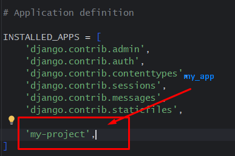

# applications
1. [x] py -m venv venv
2. [x] venv\scripts\activate
3. [x] pip install django
4. [x] django-admin startproject my_project .
5. [x] python manage.py startapp my_app
6. [x] settings.py  
   
7. [x] pip install Pillow
